20191112\_Descriptive
================
Gaotong LIU
11/12/2019

## Load and tidy data

## Factors change over time

### Happiness score change over time

### Mean Happiness score of all countries: worldwide

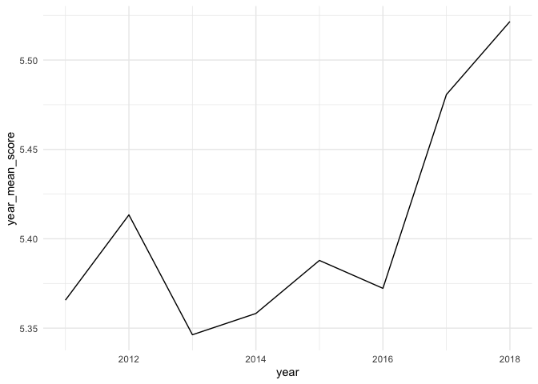<!-- -->

### Mean Happiness score of continent: region

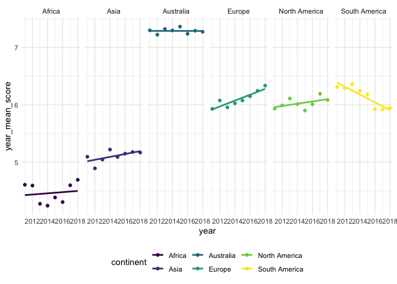<!-- -->

### Mean Happiness score of developing vs developed?

### other factors change over time

### other factors change over time: worldwide

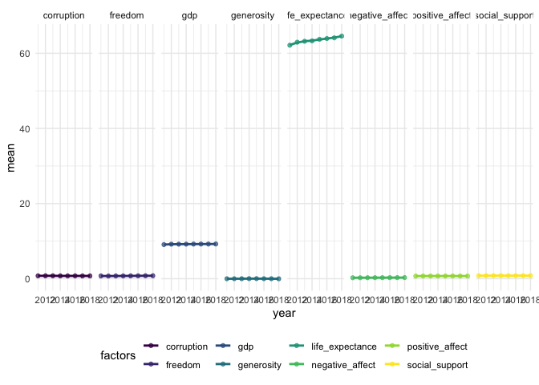<!-- -->

### other factors change over time: region

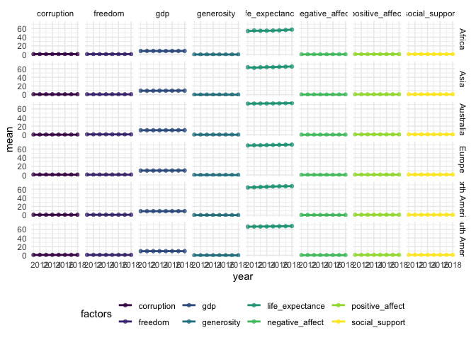<!-- -->

  - Happiness increase worldwide, only life expectancy and gdp increase
    worldwide.
  - Happiness increase in most continents, but remain the same in
    Australia and decrease in South America. However, only life
    expectancy seems to
change.

## Correlation of happiness and other factors

### Scaterplot and box plot with smooth: Worldwide

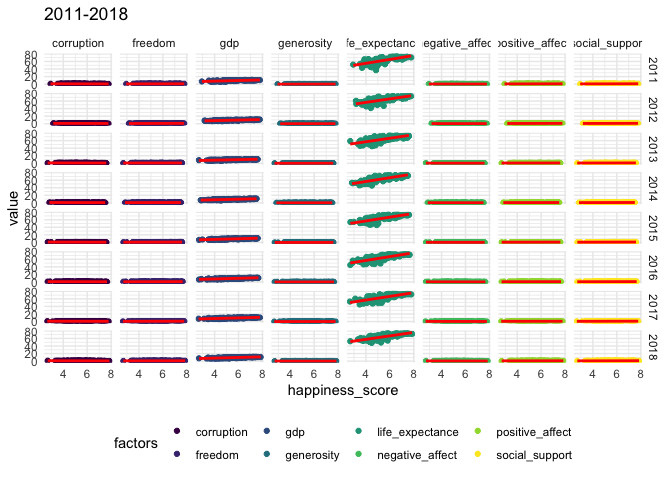<!-- -->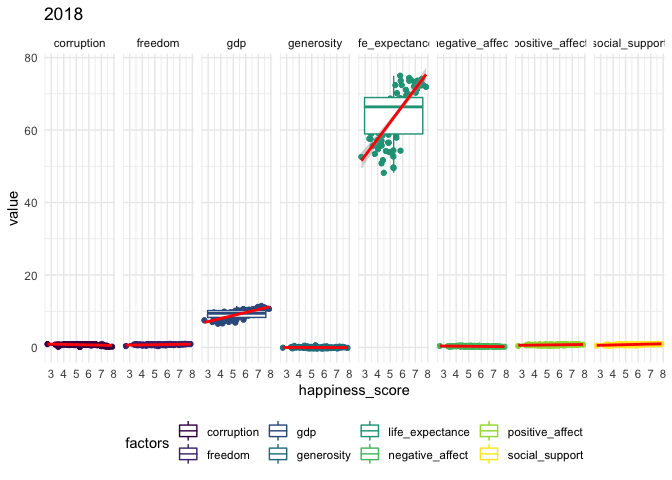<!-- -->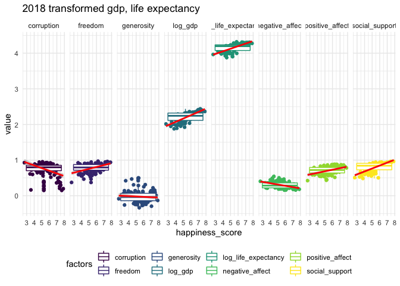<!-- -->

### Scaterplot and box plot with smooth: Region

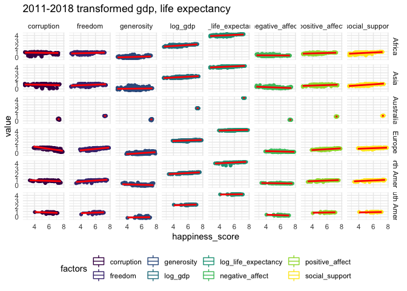<!-- -->

  - Not very useful on region
  - Worlwide can see positive correlation of happiness score and
    freedom, gdp, life expectancy, positive affect, social support.
    Negative: corruption, generosity, negative
effect

### Correlation plot: Worldwide

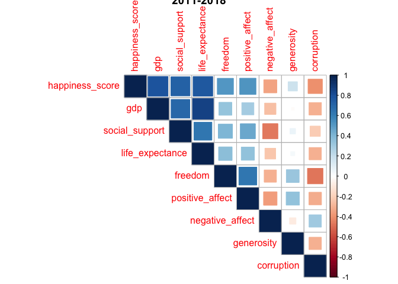<!-- -->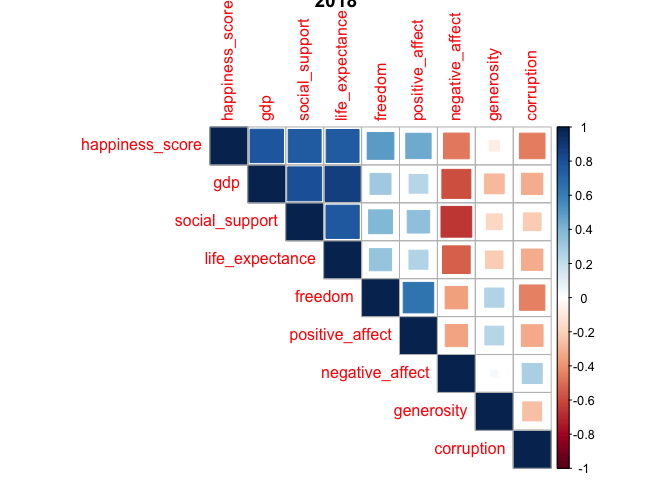<!-- -->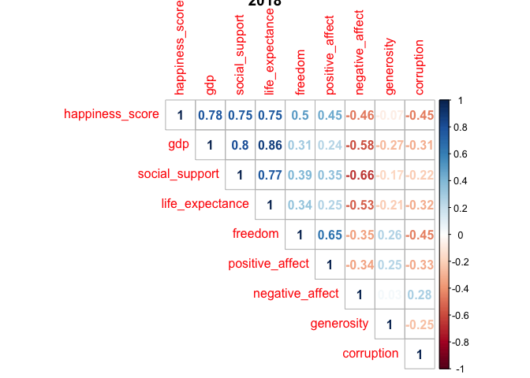<!-- -->

### Correlation plot: Region

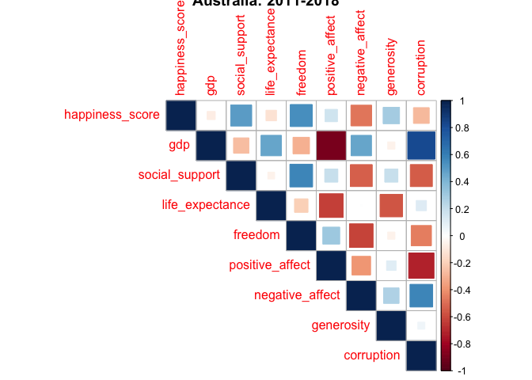<!-- -->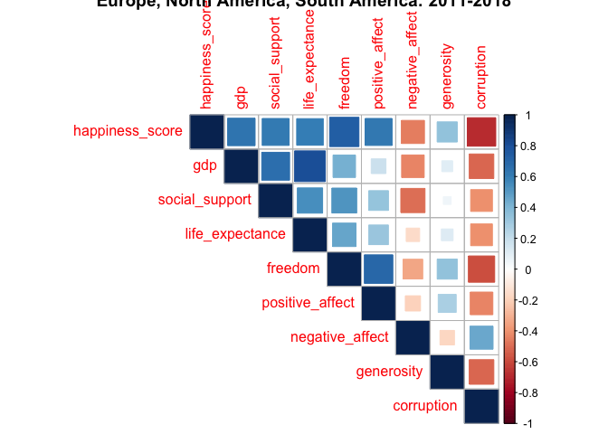<!-- -->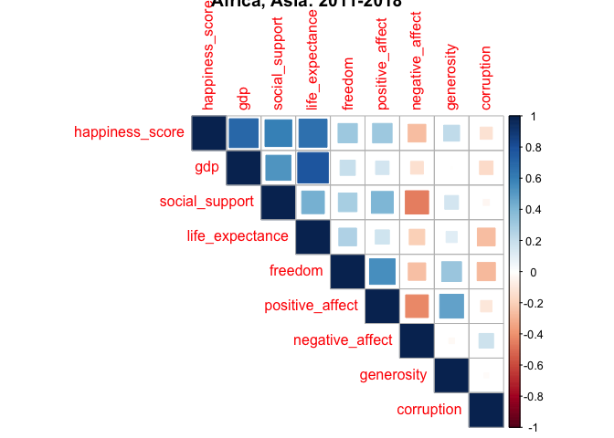<!-- -->

  - Different continent the strength of correlation is different,
    Australia: freedom, social support

Europe, North America, South America: gdp, life expectancy, freedom,
social support, corruption

Africa, Asia: gdp, life expectancy,social support
