20191117\_Descriptive and correlation
================
Gaotong LIU
11/17/2019

## Load and tidy data

## Happiness score change over time

### Mean Happiness score of all countries: worldwide

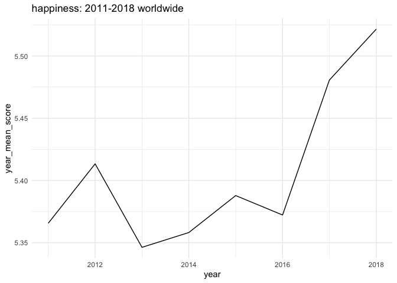<!-- -->

### Mean Happiness score of continent: region

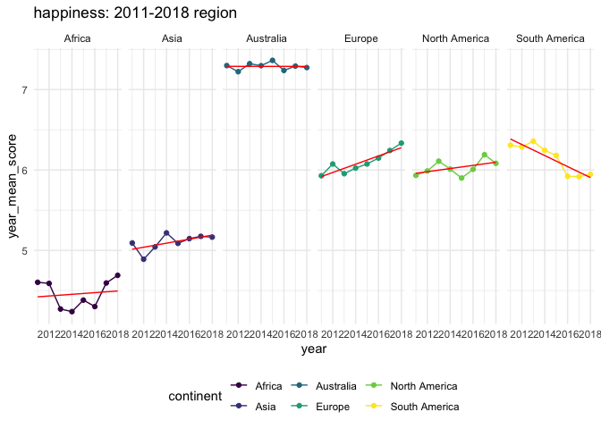<!-- -->

## other factors change over time

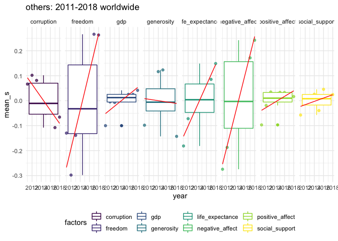<!-- -->

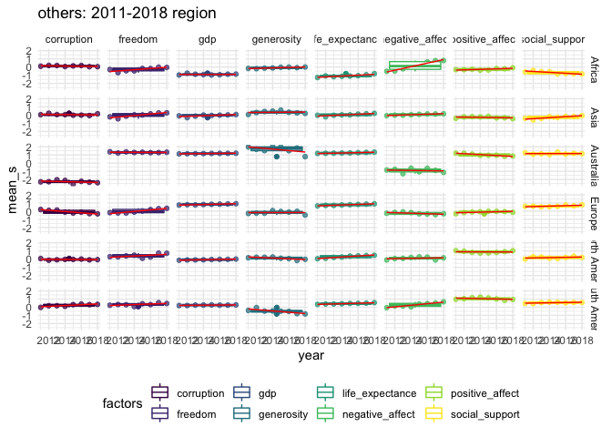<!-- -->

  - The other factors change over time **Not** meaningful for region

## Correlation of happiness and other factors

### Scaterplot and box plot with smooth: Worldwide

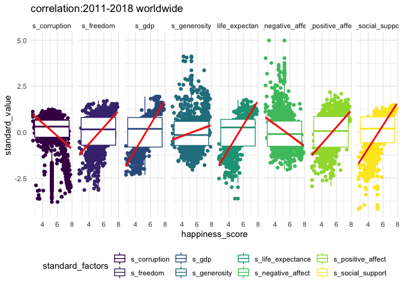<!-- -->

### Scaterplot and box plot with smooth: Region

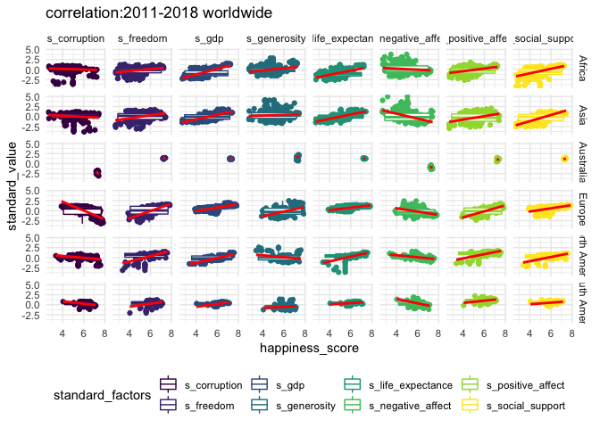<!-- -->
\* Correlation **Not** meaningful for
region

### Correlation plot: Worldwide

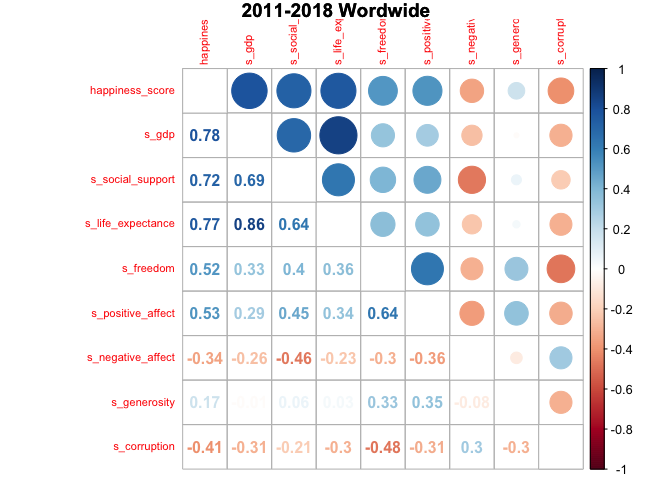<!-- -->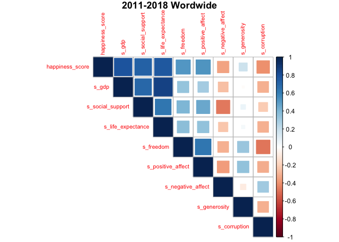<!-- -->

### Correlation plot: Region

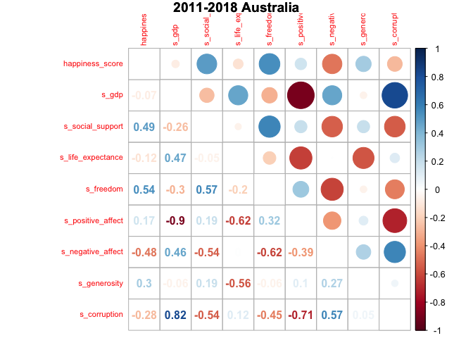<!-- -->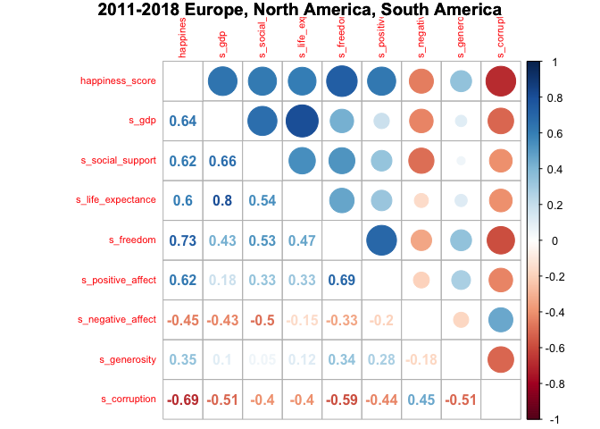<!-- -->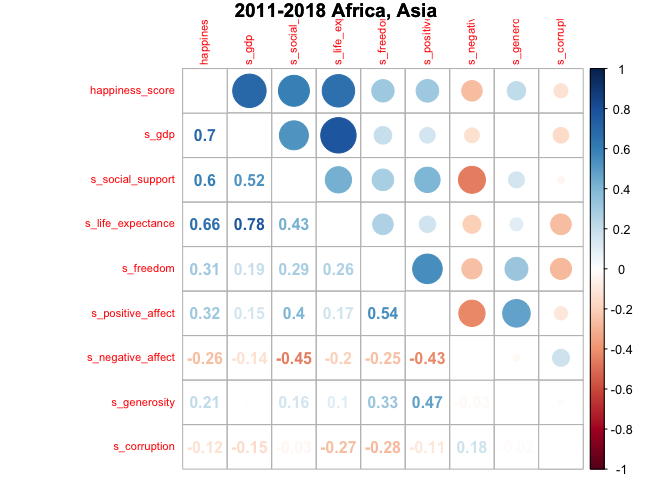<!-- -->
