20191130\_description
================
Gaotong LIU
11/30/2019

## Load and tidy data

## Happiness score change over time

### Mean Happiness score of all countries: worldwide

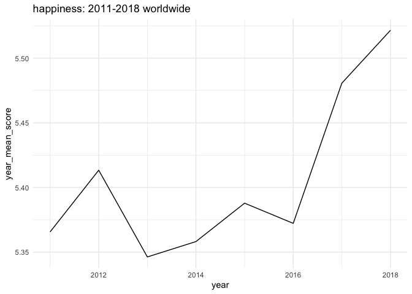<!-- -->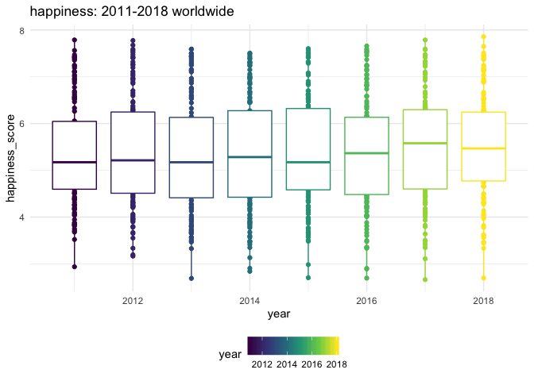<!-- -->

### Mean Happiness score of continent: region

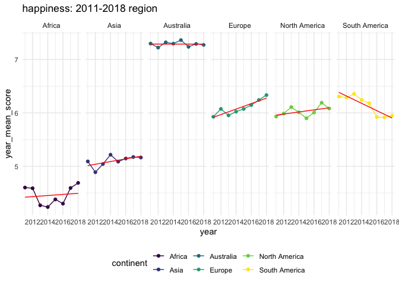<!-- -->

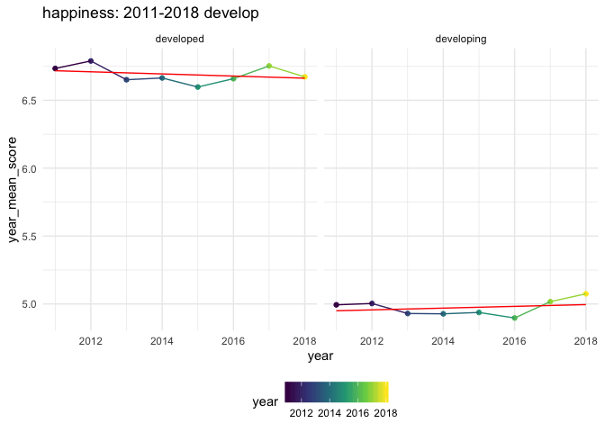<!-- -->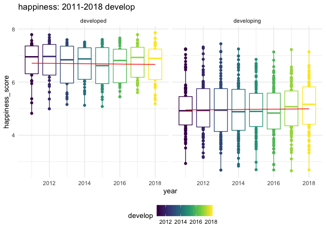<!-- -->
\#\# other factors change over time
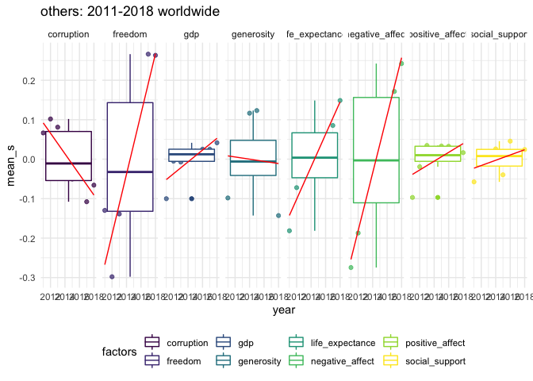<!-- -->

<!-- -->

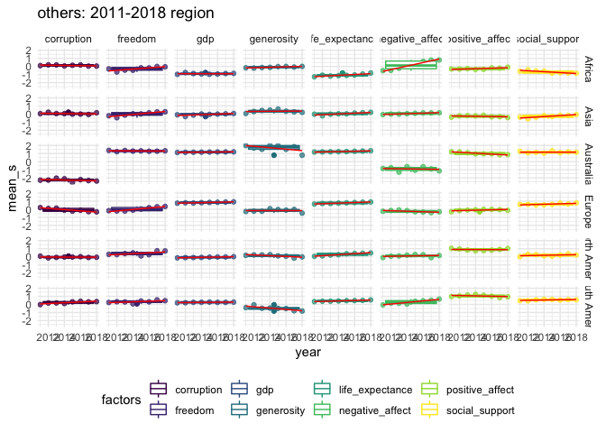<!-- -->

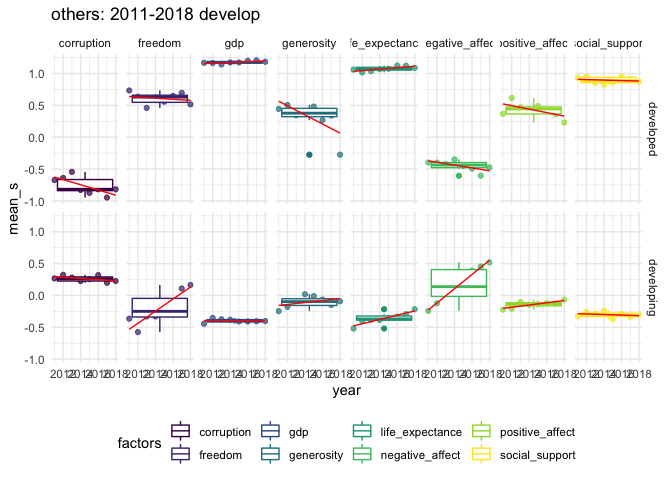<!-- -->

  - The other factors change over time **Not** meaningful for
region

## Correlation of happiness and other factors

### Scaterplot and box plot with smooth: Worldwide

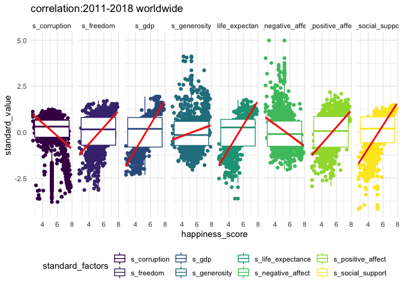<!-- -->

### Scaterplot and box plot with smooth: Region

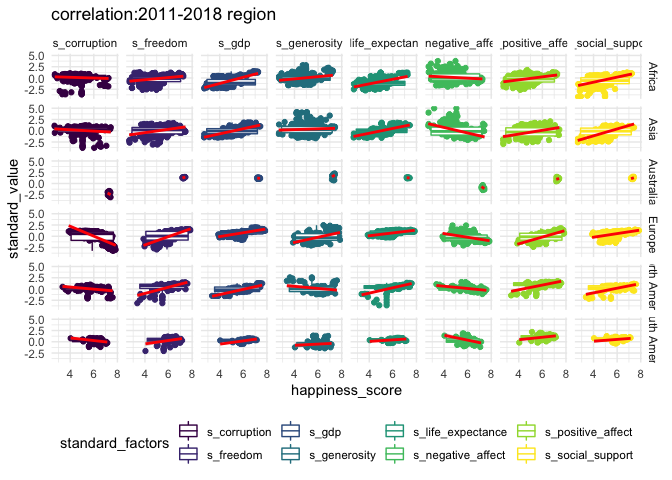<!-- -->

### Scaterplot and box plot with smooth: develop

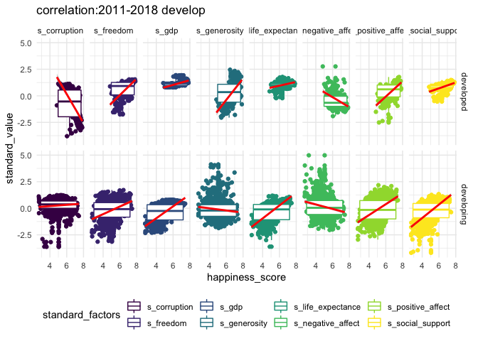<!-- -->
\* Correlation **Not** meaningful for
region

### Correlation plot: Worldwide

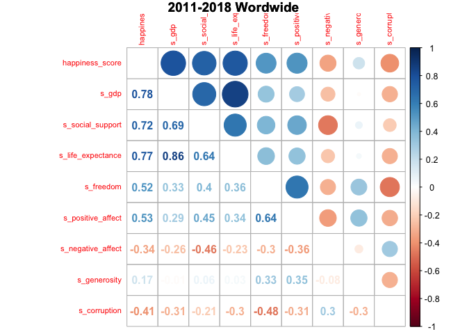<!-- --><!-- -->

### Correlation plot: Region

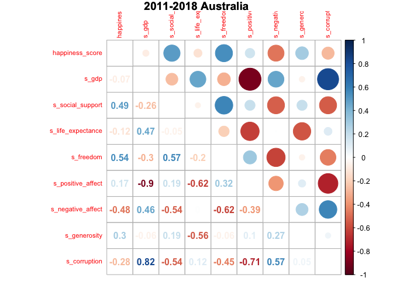<!-- -->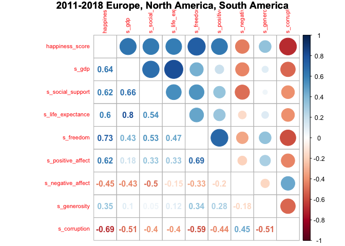<!-- -->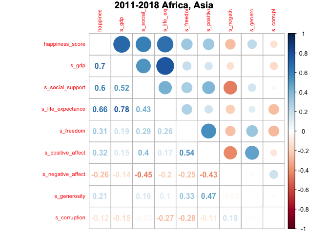<!-- -->

### Correlation plot: develop

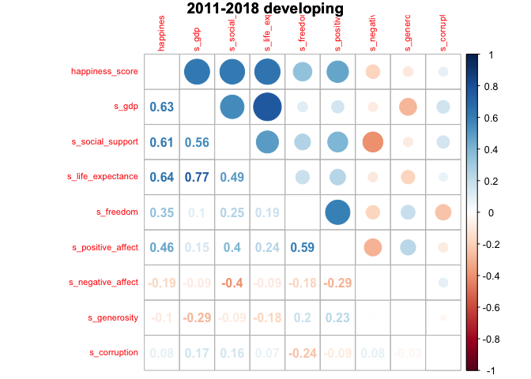<!-- -->

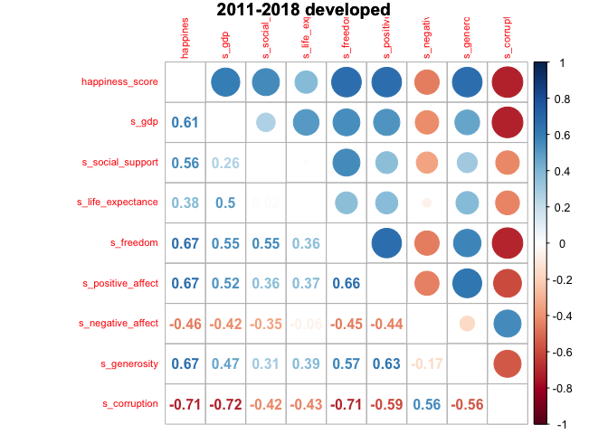<!-- --> \*
Different continent the strength of correlation is different, Australia:
freedom, social support

Europe, North America, South America: gdp, life expectancy, freedom,
social support, corruption

Africa, Asia: gdp, life expectancy,social support
