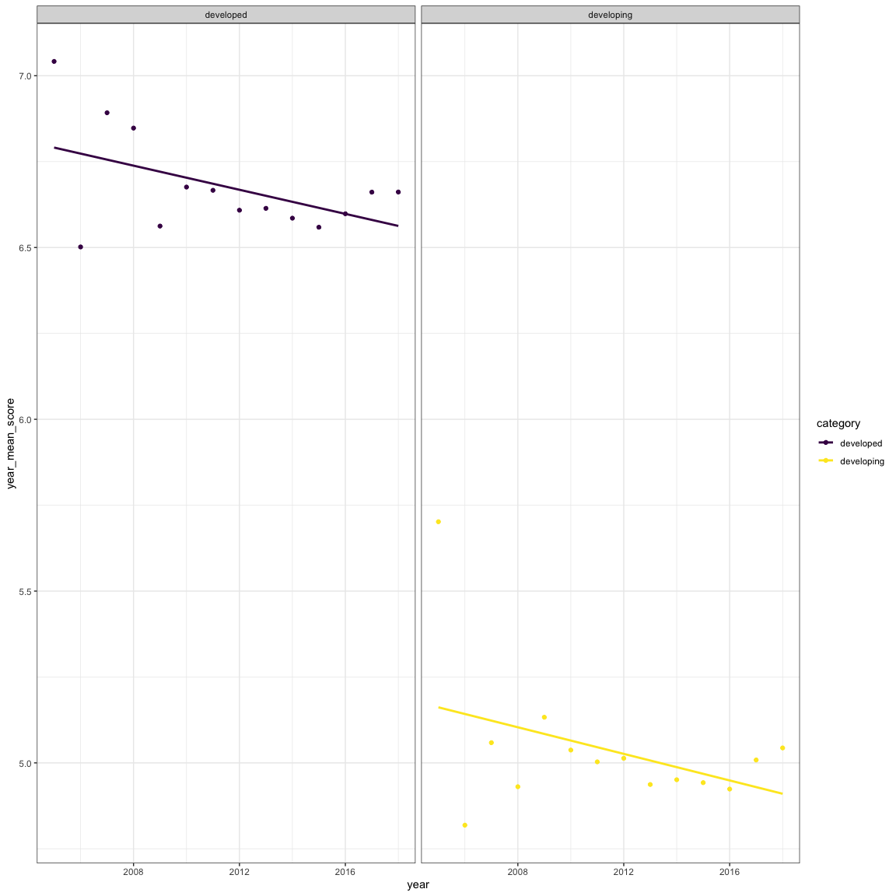
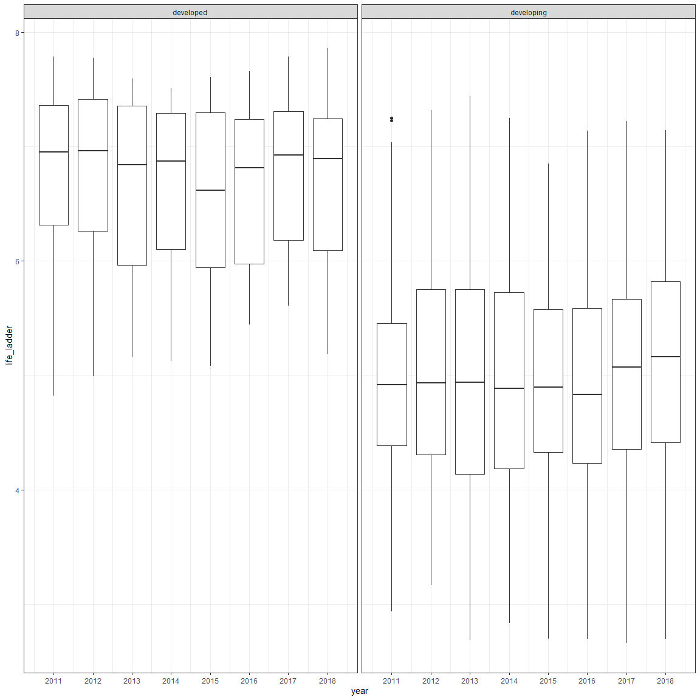
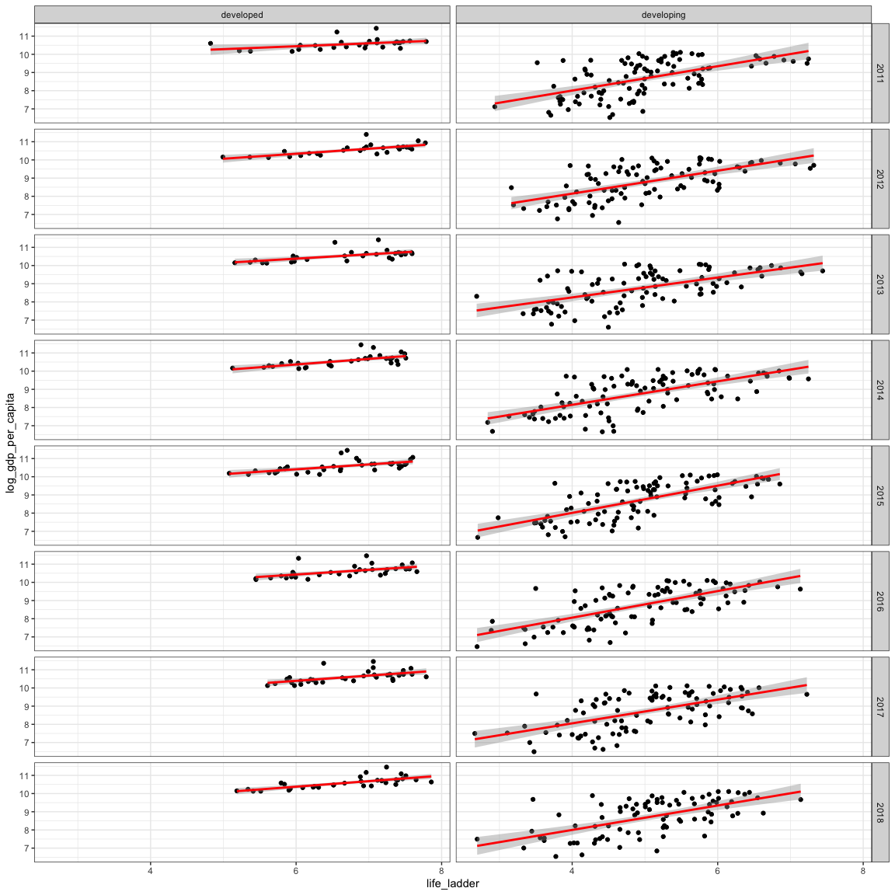

describiton
================
YuaoYang
2019/11/17

``` r
library(tidyverse)
```

    ## -- Attaching packages ----------------------------------------------- tidyverse 1.2.1 --

    ## √ ggplot2 3.2.1     √ purrr   0.3.2
    ## √ tibble  2.1.3     √ dplyr   0.8.3
    ## √ tidyr   1.0.0     √ stringr 1.4.0
    ## √ readr   1.3.1     √ forcats 0.4.0

    ## -- Conflicts -------------------------------------------------- tidyverse_conflicts() --
    ## x dplyr::filter() masks stats::filter()
    ## x dplyr::lag()    masks stats::lag()

``` r
library(corrplot) 
```

    ## corrplot 0.84 loaded

``` r
knitr::opts_chunk$set(
  fig.width = 12,
  fig.asp = 1,
  out.width = "100%"
)
theme_set(theme_bw() + theme(legend.position = "right"))
```

# manipulate the data

``` r
data = read_csv("data/final_data.csv") %>%
  select(country_name:negative_affect) %>%
  unique() %>%
  mutate(gdp = exp(log_gdp_per_capita)) %>%# in the original data, they use log get the result, i try to transfer in the real way
  mutate( category = ifelse(gdp > 25000, "developed", "developing")) # actually there is no speicific cretiria to distinguish the developed and developing country.
```

    ## Parsed with column specification:
    ## cols(
    ##   country_name = col_character(),
    ##   year = col_double(),
    ##   life_ladder = col_double(),
    ##   log_gdp_per_capita = col_double(),
    ##   social_support = col_double(),
    ##   healthy_life_expectancy_at_birth = col_double(),
    ##   freedom_to_make_life_choices = col_double(),
    ##   positive_affect = col_double(),
    ##   negative_affect = col_double(),
    ##   generosity = col_double(),
    ##   perceptions_of_corruption = col_double(),
    ##   long = col_double(),
    ##   lat = col_double()
    ## )

``` r
data  %>%
  mutate(category = factor(category, levels  = c("developed", "developing"))) %>%
  group_by(year, category) %>% 
  summarise(year_mean_score = mean(life_ladder)) %>% 
  ggplot(aes(x = year, y = year_mean_score, color = category)) +
  geom_point() +
  geom_smooth(method = lm, se = FALSE) +  
  facet_grid(. ~ category)
```



``` r
data %>%
  group_by(year, category) %>% 
  ggplot(aes(x = year, y = life_ladder, group = year))+ geom_boxplot() + facet_grid(.~category)+ scale_x_continuous(
    breaks = c(2011, 2012, 2013,2014,2015,2016,2017,2018))
```



``` r
data %>%
  group_by(year, category) %>%
  ggplot(aes(x = life_ladder, y = log_gdp_per_capita)) +
  geom_point() +
  geom_smooth(method = lm, color = "red") +
  facet_grid(year ~ category)
```


