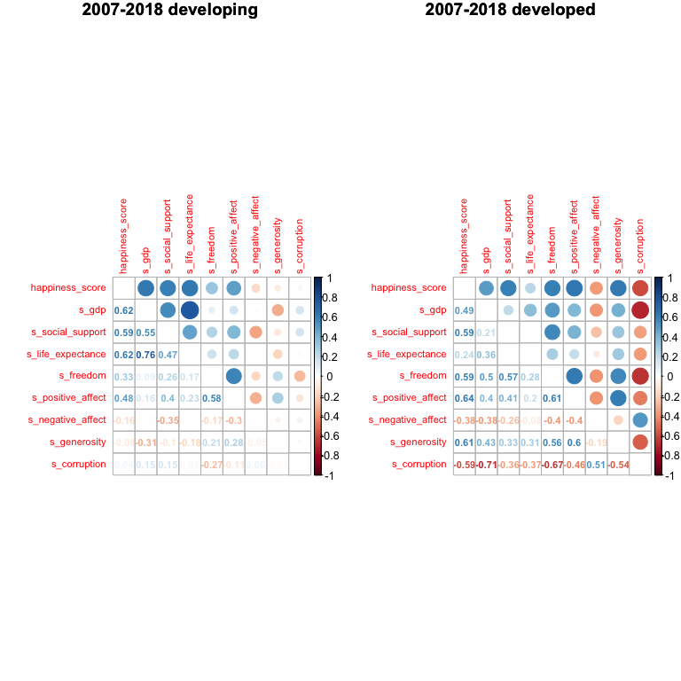

description\_final
================
YuaoYang
2019/11/30

### Mean Happiness score of all countries: worldwide/continent/developing level

We try to find the general trend of mean happiness changed via time by
worldwide, regions and developing levels. From the first plot, we can
easily find that the mean happiness score changed variously via time,
but the overall score changed between 5.0 to 6.0. These changes can be
regarded as moderate changes here. From the second plot, we divided
these counties in different regions by the geographic continent.
Australia has the overall highest and most steady mean happiness score
compares to other continents. And Africa has the overall lowest and most
fluctuant mean happiness score. From the third plot, we group these
countries in developing and developed country by the criteria that Some
economists prefer to see a per capita GDP of at least $25,000 to be
comfortable declaring a country as developed,
however(<https://www.investopedia.com/updates/top-developing-countries/>).
The mean happiness score is obviously higher in developed countries than
it in developing countries. It is about 6.5 in developed one, and is
about 5.0 in developing
one.

### The correlation plot for happiness score and factors worldwide:

From the overall worldwide correlation plot for happiness score and
factors, except the factors negative\_affect and corruption, other
factors have the positive association with happiness score, and gdp is
the most associated factor. In addition, many factors have associations
like gdp and
life\_expectance.

### The correlation plot for happiness score and factors in different region:

According to the overall trend in mean happiness score, we divide
continents in three groups. Compared with the other groups, Australia
which has the highest happiness score has the inverse association with
factors. Compared with the factor gdp in other two groups, gdp has the
negative and non-significant association with outcome, and gdp has the
negative and significant association with factor negative-affect. In
other two group, the factors freedom, positive\_affect,
negative\_affect,generosity,corruption has less significant association
with happiness score, and the other factors has the less significant
association with factor corruption in Africa and Asia
group.

### The correlation plot for happiness score and factors in developed country and developing country:

According to the plot, compared with developed country, life\_expectance
has the higher association with happiness score in developing country,
and freedom, positive\_affect, negative\_affect,generosity,corruption
has less significant association with happiness score. Especially,
corruption plays no role in the association with outcome in developing
country, but gdp is most associated with outcome.

### Statistical Analysis:

    ## 
    ## Call:
    ## lm(formula = happiness_score ~ freedom + negative_affect + generosity + 
    ##     life_expectance + positive_affect + corruption * develop + 
    ##     social_support * develop, data = data)
    ## 
    ## Residuals:
    ##      Min       1Q   Median       3Q      Max 
    ## -1.67466 -0.33840  0.02723  0.36473  1.90737 
    ## 
    ## Coefficients:
    ##                                   Estimate Std. Error t value Pr(>|t|)    
    ## (Intercept)                      -4.351529   0.683993  -6.362 2.64e-10 ***
    ## freedom                           0.215809   0.142792   1.511 0.130907    
    ## negative_affect                   0.160111   0.203267   0.788 0.431005    
    ## generosity                       -0.112044   0.104853  -1.069 0.285429    
    ## life_expectance                   0.054419   0.002772  19.635  < 2e-16 ***
    ## positive_affect                   2.327350   0.189293  12.295  < 2e-16 ***
    ## corruption                       -0.740659   0.131358  -5.638 2.05e-08 ***
    ## developdeveloping                 2.450152   0.678925   3.609 0.000318 ***
    ## social_support                    6.169076   0.686530   8.986  < 2e-16 ***
    ## corruption:developdeveloping      0.935168   0.194548   4.807 1.69e-06 ***
    ## developdeveloping:social_support -4.039126   0.704700  -5.732 1.20e-08 ***
    ## ---
    ## Signif. codes:  0 '***' 0.001 '**' 0.01 '*' 0.05 '.' 0.1 ' ' 1
    ## 
    ## Residual standard error: 0.5643 on 1501 degrees of freedom
    ##   (192 observations deleted due to missingness)
    ## Multiple R-squared:  0.755,  Adjusted R-squared:  0.7534 
    ## F-statistic: 462.5 on 10 and 1501 DF,  p-value: < 2.2e-16

    ## 
    ## Call:
    ## lm(formula = happiness_score ~ gdp + social_support + freedom + 
    ##     negative_affect + generosity + life_expectance + positive_affect, 
    ##     data = data)
    ## 
    ## Residuals:
    ##      Min       1Q   Median       3Q      Max 
    ## -1.95757 -0.34344  0.02332  0.36621  1.93191 
    ## 
    ## Coefficients:
    ##                  Estimate Std. Error t value Pr(>|t|)    
    ## (Intercept)     -3.079261   0.164131 -18.761  < 2e-16 ***
    ## gdp              0.384557   0.023933  16.068  < 2e-16 ***
    ## social_support   1.721325   0.179059   9.613  < 2e-16 ***
    ## freedom          0.573282   0.130620   4.389 1.21e-05 ***
    ## negative_affect -0.233670   0.193112  -1.210    0.226    
    ## generosity       0.530652   0.096723   5.486 4.78e-08 ***
    ## life_expectance  0.028146   0.003476   8.096 1.13e-15 ***
    ## positive_affect  2.029272   0.182285  11.132  < 2e-16 ***
    ## ---
    ## Signif. codes:  0 '***' 0.001 '**' 0.01 '*' 0.05 '.' 0.1 ' ' 1
    ## 
    ## Residual standard error: 0.5643 on 1571 degrees of freedom
    ##   (125 observations deleted due to missingness)
    ## Multiple R-squared:  0.7498, Adjusted R-squared:  0.7487 
    ## F-statistic: 672.6 on 7 and 1571 DF,  p-value: < 2.2e-16
