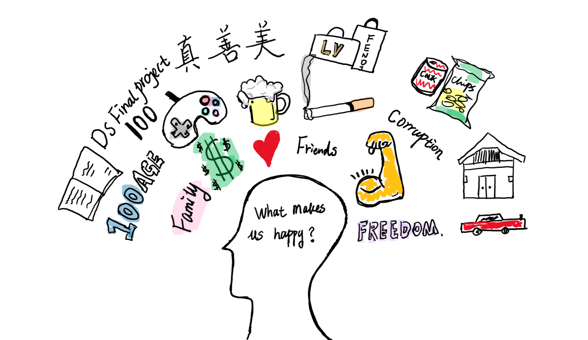

## Motivation
As civilizations are developing, the happiness of human being becomes an ambiguous topic.  Simple material enjoyment is no longer the only determinant of mental pleasure. So, how the state of happiness in the world change overtime and what makes the world happy? We are trying to find the reasons, and our final goal is to provide helpful information for governments to make better decisions with respect to higher life evaluation.  

## Data Source

The information was gathered primarily from *The World Happiness Report* created by the United Nations Sustainable Development Solutions Network [(UNSDSN)](https://worldhappiness.report/). It is an annual landmark survey of the state of global happiness that ranks 165 countries by how happy their citizens perceive themselves to be. The dataset we use contains rankings of national happiness together with various life factors correlated from 2005 to 2018.

Furthermore, we find capital longitude and latitude from [kaggle](https://www.kaggle.com/sabihaif/world-happiness-report-analysis/data) to locate a country when drawing association map.

## Overall analysis

* Firstly, to see the overal change of world happiness score along time, we draw a [Global animation Map](global_animation_plot.html);

* Secondly, to see the association between different factors and happiness score among years, we draw an [interactive association app](https://yuqimiao.shinyapps.io/Gaotong/)

* Then, we perform Correlation analysis and Multiple Linear Regression in the [Final Report](about.html). We analyze the correlations between happiness score and interested factors in different situations. 

## Conclusion

In this project, we firstly use global animation map to explore the world happiness score changing trend, where we can find that although the happiness score slightly increases from 2007 to 2018 in the worldwide level, several regions have decreasing trends.

Then we build an app to find the associated factors to happiness score in worldwide, by region and by developing level, we can find that as the economy develops to higher level, the increasing rate of happiness score is increasing. It is true that money is important to happiness, but besides money, what is also important? In the final report, we use stratified analysis to explore association factors in countries in different developing levels.

For developing countries, happiness mostly depends on economic growth and health. For developed countries, people perceive themselves to be happy when there is no corruption in the business and government and when they are willing to donate.

For more details , click by [report](about.html).

## Screencast

<iframe width="560" height="315" src="https://www.youtube.com/embed/gCIvLZXb04A" frameborder="0" allow="accelerometer; autoplay; encrypted-media; gyroscope; picture-in-picture" allowfullscreen></iframe>